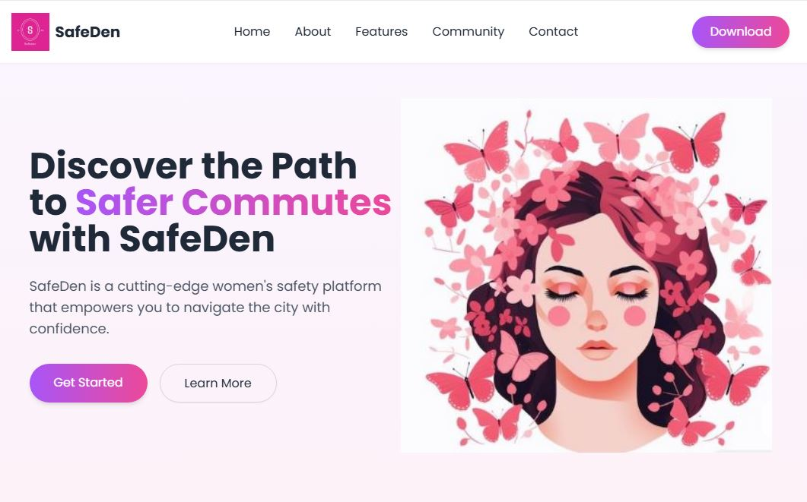

  <h1>SafeDen : Empowering Safer Commutes for Women</h1>
   
  

  <h3>Aimed to provide a safe commuting experience !</h3>
  

<h5>
SafeDen is a comprehensive safety platform designed specifically for women commuters. 
At its core, SafeDen believes that technology should enhance freedom rather than restrict it.
Whether you're planning your daily commute, traveling to a new area, or finding yourself in an unexpected situation, SafeDen provides the tools you need to stay connected, informed, and secure.
</h5>
 

 
 

<b>Idea:</b> SafeDen addresses the critical issue of women's safety during commuting by creating a comprehensive platform that combines real-time data, community verification, and smart monitoring systems.
 
<b>Solution:</b> This project provides UI or front end part of a project aimed at dynamic safety mapping, journey monitoring, verified safe locations, multi-level emergency responses, and transportation safety integration—all in one platform that empowers women to travel confidently.
 
<b>Build Process: </b>We developed SafeDen using a user-centered design approach created this website to refine functionality.

 
 

Tech stack: HTML, CSS, JS, typescript

 
 

Video Demo: 

 
 
<h3>To run the project in your system locally, use the below commands:</h3>
 

npm install -g pnpm  
npm install --legacy-peer-deps  
pnpm install  
pnpm run dev  
pnpm run build  
pnpm start  

